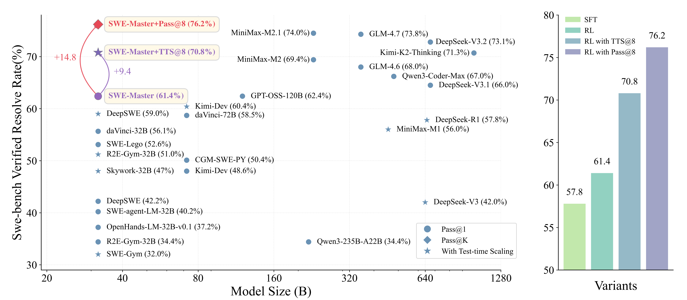
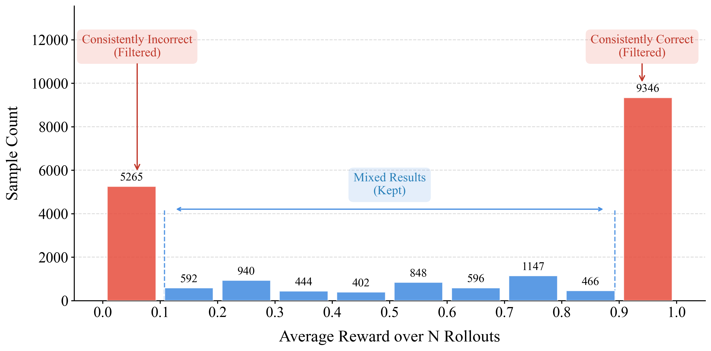
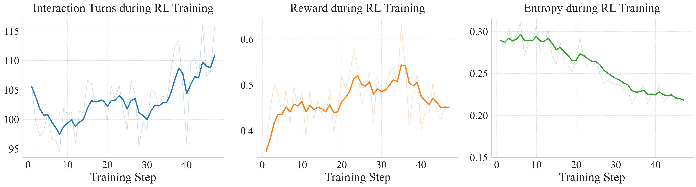
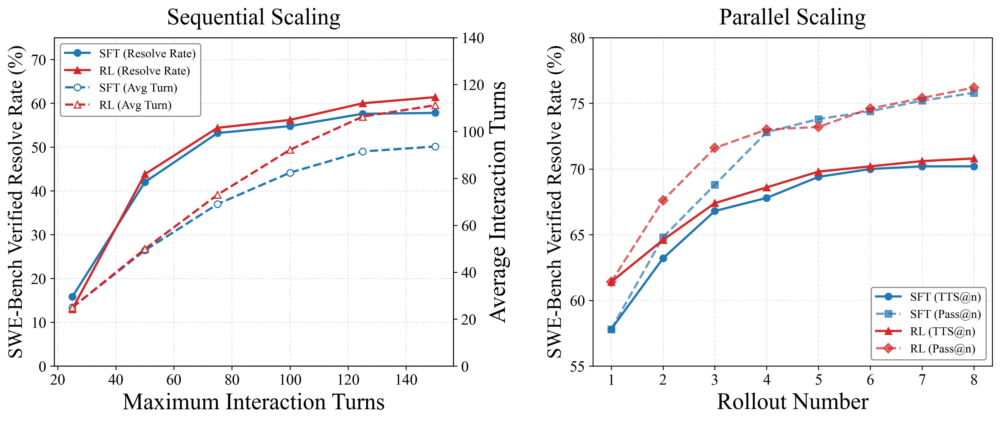
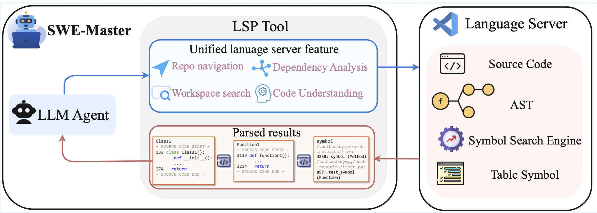
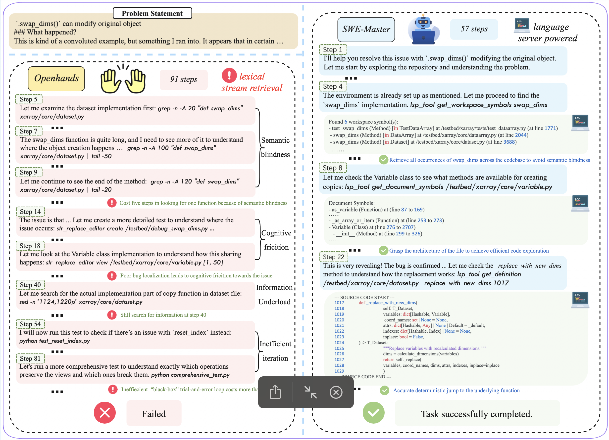

<h1 align="center">SWE-Master: Unleashing the Potential of Software Engineering Agents via Post-Training</h1>


<div align="center">
<a href="./LICENSE"></a>
<a href="./LICENSE"></a>
<a href="https://huggingface.co/"></a>
<a href="https://arxiv.org/pdf/2602.03411" target="_blank"></a>
</div>


<h5 align="center"> If you like our project, please give us a star ⭐ on GitHub for the latest update.</h5>

<p align="center">
  
</p>

# ✨ News
+ [24 Feb 2026] We have open-sourced the training and inference code, as well as all associated models for [**SWE-Master**](https://arxiv.org/abs/2503.05592). Start training and evaluating your own code agents!
+ [4 Feb 2026] ⚡️⚡️ [**SWE-Master**](https://arxiv.org/abs/2503.05592): We introduce SWE-Master, a fully reproducible post-training framework for Qwen2.5-Coder-32B that integrates agentic SFT and RL to achieve 61.4% (Pass@1) and 70.8% (TTS@8) resolve rates on SWE-bench Verified. Meanwhile, the framework incorporates IDE-level capabilities during inference via LSP-driven tool.
+ [4 Feb 2026] ⚡️⚡️ [**SWE-World**](https://arxiv.org/pdf/2602.03419): We introduce SWE-World, a fully Docker-free framework that replaces physical execution environments with learned surrogates. It lifts Qwen2.5-Coder-32B from 6.2% to 55.0% on SWE-bench Verified via agentic SFT and RL, and further attains 68.2% through test-time scaling (TTS@8).

# 💡 Overview

**SWE-Master** is an end-to-end, open-source post-training pipeline for software engineering (SWE) agents.   It covers **trajectory synthesis & curation**, **long-horizon supervised fine-tuning (SFT)**, **reinforcement learning with execution feedback (RLVR)**, and **test-time scaling (TTS)** via simulated verification and ranking. Furthermore, the framework supports advanced tool-use capabilities, including **LSP-integrated tools** (based on the Language Server Protocol), and incorporates a summary-based context manager for efficient state tracking.


# 🤖 Models
You can find all the trained models [**Here**](https://huggingface.co/collections/RUC-AIBOX/swe-agent-series), including:
- [SWE-Master-4B-SFT](https://huggingface.co/RUC-AIBOX/SWE-Master-4B-SFT)
- [SWE-Master-4B-RL](https://huggingface.co/RUC-AIBOX/SWE-Master-4B-RL)
- [SWE-Master-32B-SFT](https://huggingface.co/RUC-AIBOX/SWE-Master-32B-SFT)
- [SWE-Master-32B-RL](https://huggingface.co/RUC-AIBOX/SWE-Master-32B-RL)
- [SWE-Master-32B-RL-LSP](https://huggingface.co/RUC-AIBOX/SWE-Master-32B-LSP)


# ✨ Key Insights
1. **Fully Post-Training Pipeline** WE-Master provides a transparent, end-to-end framework spanning trajectory synthesis, long-horizon SFT, and RL with execution feedback, demystifying how high-performance SWE capabilities emerge from open-source models.
2. **Effective Test-Time Scaling (TTS) via Simulated Feedback**: Beyond simple repetition, we leverage LLM-based environment feedback for simulated verification and ranking. This strategy narrows the gap between Pass@1 and Pass@k, reaching a 70.8% resolve rate.
3. **IDE-Level Semantic Navigation with LSP-Driven Tools**: By integrating Language Server Protocol (LSP) capabilities, SWE-Master replaces fragile text searches with deterministic tools (e.g., go-to-definition), significantly reducing search friction and enhancing interaction efficiency in complex codebases.


# ✨ Training Recipe for SWE-Master
## Data Curation and SFT
We integrate multiple open-source SWE datasets packaged with Docker environments and generate rollouts with teacher models, then apply filtering to produce SFT-ready trajectories. The statistical metrics are shown below:

| Dataset | Source | #Samples | #Images | #Repos | Resolved Inst. | Resolved Trajs. | Final SFT Trajs. |
|---|---:|---:|---:|---:|---:|---:|---:|
| SWE-Gym | Real | 2,438 | 2,438 | 11 | 1,068 | 5,685 | 2,948 |
| SWE-rebench | Real | 6,542 | 6,542 | 1,429 | 4,268 | 10,861 | 7,157 |
| R2E-Gym | Synthetic | 4,578 | 4,578 | 10 | 3,234 | 18,398 | 2,462 |
| SWE-smith | Synthetic | 14,103 | 114 | 114 | 6,353 | 17,901 | - |

Additionally, we perform $N$ rollouts for each issue and utilize the average resolve rate as a proxy for task difficulty. As illustrated in the figure below, the resulting distribution exhibits a bimodal pattern, where the majority of issues are either consistently solved (trivial) or consistently failed (intractable). Consequently, we exclude these polar extremes from the candidate pool, selectively retaining only those issues that yield a mixture of successful and failed trajectories.

<p align="center">
  
</p>

## Reinforcement Learning

We adopt Reinforcement Learning from Verifiable Rewards (RLVR) as our foundational framework, utilizing the Group Relative Policy Optimization (GRPO) algorithm to directly optimize SWE-Master-SFT. Drawing on established RL methodologies, we incorporate several empirical optimizations to enhance training stability and performance. The final objective function is formulated as follows (refer to the technical report for comprehensive details):

$$
\mathcal{J}(\theta) = \mathbb{E}_{q \sim P(Q), \{o_i\}_{i=1}^G \sim \pi_{\text{old}}} \left[ \frac{1}{G} \sum_{i=1}^G \frac{1}{L_{\text{max}}} \sum_{t=1}^{|o_i|} \min \left( \rho_{i,t}(\theta) \hat{A}_i, \text{clip}\left(\rho_{i,t}(\theta), \beta_{\text{low}}, \beta_{\text{high}}\right) \hat{A}_i \right) \right]
$$

where $P(Q)$ denotes the distribution of input prompts, and the clipping bounds are defined as $\beta_{\text{low}} = 1-\varepsilon_{\text{low}}$ and $\beta_{\text{high}} = 1+\varepsilon_{\text{high}}$. The term $L_{\text{max}}$ represents a fixed constant for length normalization. The probability ratio $\rho_{i,t}(\theta)$ and the group-relative advantage $\hat{A}_i$ are given by:

$$
\rho_{i,t}(\theta) = \frac{\pi_\theta(o_{i,t}|q, o_{i,<t})}{\pi_{\text{old}}(o_{i,t}|q, o_{i,<t})}, \quad \hat{A}_i = R_i - \frac{1}{G-1}\sum_{j=1, j\neq i}^G R_j
$$

The training dynamics of RL are shown in the figure below.

<p align="center">
  
</p>

## Test-Time Scaling
We implemente two primary paradigms for TTS: sequential scaling, which involves increasing the allowance of interaction turns; and parallel scaling, which generates multiple trajectories and corresponding patches, followed
by employing a specific verifier to select the optimal candidate for submission. For parallel scaling, we use **SWE-World** as the verifier to choose the optimal patch.

<p align="center">
  
</p>

# ✨ IDE-Level Code Capacity

## Overview of LSP Tools
The Language Server Protocol (LSP) is a standardized standard that decouples development tools from language-specific intelligence, enabling IDE-grade semantic insights such as cross-file reference tracking and symbol resolution. Inspired by human-IDE workflows, we implemented **`lsp_tool`**, which adapts the LSP specification into a function-calling format optimized for LLMs. This tool encapsulates repository navigation, dependency analysis, and code understanding into a unified API. By utilizing a specialized parser to handle the underlying JSON-RPC complexity, `lsp_tool` empowers agents with deterministic, semantics-aware navigation, bridging the gap between raw protocol data and model-driven code exploration.

<p align="center">
  
</p>

## Case Study

To explicitly demonstrate how `lsp_tool` empowers the model to transcend the limitations of lexical search, we present a comparative case study on **pydata_xarray-6812** from SWE-bench Verified. The task requires fixing a subtle bug where `.swap_dims()` incorrectly modifies the original dataset object in-place due to improper reference handling. 
The figure below visualizes the contrasting trajectories between the current frontier framework, **OpenHands**, and our enhanced framework integrated with `lsp_tool`, and the detailed analysis is provided in the paper:


<p align="center">
  
</p>


# 🏃 Quick Start
## Data Preparation
### Data Download
```bash
bash ./data_preparation/download_swe_datasets.sh
```

### Data Preprocessing (Optional)
Add a prior difficulty grading to each issue. These grades are generated using Minimax-M2 and GLM-4.6.
```bash
# Add prior difficulty scores
python ./data_preparation/difficulty_score_add.py

# Filter for high-quality issues by removing those with consistently all-pass or all-fail rollouts based on difficulty scores
python ./data_preparation/difficulty_score_filter.py
```

### Offline Unit Test Generation (Optional)
Generate unit tests for `swe-gym`, `swebench-verified`, and `swe-rebench` to facilitate direct loading during evaluation. 
This process generates two types of caches:
1. JSON files for unit tests mapped to each `instance_id` within the specified `base_dir`.
2. A dataset containing the `make_test_spec` field. 

During inference, the system first checks if the dataset contains the `make_test_spec` field, then checks for the cached directory in the workspace. If neither is found, it reverts to the default loading method.

**Note:** If `base_dir` is specified, you must update the corresponding `base_dir` in `./R2E-Gym/src/r2egym/agenthub/runtime/docker.py`.

```bash
python ./data_preparation/make_test_spec.py \
    --base_dir /your/custom/cache/path \
    --data_file_path /your/path/to/data.json
```

For a completed conversion demo, refer to: `./data_examples/inference_data/ood_data`
The corresponding unit tests cache is located at: `./data_examples/inference_data/ood_data_unit_tests_cache`

## Inference & Evaluation

### Environment Setup 

```bash
# Install uv
curl -LsSf https://astral.sh/uv/install.sh | sh
source $HOME/.local/bin/env

# Activate venv
uv venv
source .venv/bin/activate
uv sync && uv pip install -e .

# Install SWE dataset-related packages for inference
uv pip install ./swebench_fork_swegym-2.0.13-py3-none-any.whl

uv pip install ./swebench_fork_swerebench-4.0.3-py3-none-any.whl

uv pip install ./swesmith-0.0.7-py3-none-any.whl
```

### Inference
- We have built our project upon the [R2E-Gym](https://github.com/R2E-Gym/R2E-Gym) framework and conducted further development. **For parameter details, see [Parameter Description](./R2E-Gym/rollout_foundation_model/readme.md)**

#### Standard Inference
```bash 
# Batch generation
bash ./R2E-Gym/rollout_foundation_model/run_deepseek_v3.sh

# Debugging (e.g., verifying Docker connectivity and interaction workflows)
bash ./R2E-Gym-opensource/run.py
```

#### Inference with LSP Tool
```bash 
# Standard inference with LSP-Tool integration
bash ./R2E-Gym/rollout_foundation_model/lsp/run_deepseek_v3_lsp.sh

# Few-shot configuration: used to prevent the policy model from over-relying on traditional tools during training (LSP-Tool is disabled here)
bash ./R2E-Gym/rollout_foundation_model/lsp/run_minimax_lsp_few_shot.sh

# Model-specific few-shot configurations are located here:
ls ./R2E-Gym/rollout_foundation_model/lsp/swe_LSP_few_shot

# Quality filtering for trajectories using LSP-Tool (Rule-based and LLM-based)
bash ./R2E-Gym/rollout_foundation_model/lsp/sft_data_filter/batch_run_llm_judge.sh
```

#### Inference with Context Manager
```bash 
bash ./R2E-Gym/rollout_foundation_model/memory/run_deepseek_v3_memory.sh

# Convert a single trajectory using context manager into multiple training trajectories
python ./R2E-Gym/rollout_foundation_model/memory/sft_process_memory_data_01.py
```


#### Examples and Visualization

A sample trajectory file generated after inference is available at:  
`./data_examples/r2e-gym-inference-traj/glm46_0_used_swe_rebench_1_demo.jsonl`

To facilitate a more intuitive and efficient analysis of the generated trajectories, you can use the following scripts to convert them into HTML format for visualization:

```bash
# Generate English visualization
python ./R2E-Gym/app/json2html_for_view-en.py [jsonl-file-path] -o [html-file-path]

# Generate Chinese visualization
python ./R2E-Gym/app/json2html_for_view-zh.py [jsonl-file-path] -o [html-file-path]
```

For the demo data provided, the corresponding visualized HTML files are located at:
- **English version:** `./data_examples/r2e-gym-inference-traj/glm46_0_used_swe_rebench_1_demo-en.html`
- **Chinese version:** `./data_examples/r2e-gym-inference-traj/glm46_0_used_swe_rebench_1_demo-zh.html`


### Reproducing SWE-Master Results
Use the following scripts to reproduce the evaluation results for SWE-Master:
```bash
# Launch vLLM server
bash ./R2E-Gym/rollout_trained_model/vllm_server_launch.sh

# Run evaluation
bash ./R2E-Gym/rollout_trained_model/qwen25_coder_15k_lsp_with_gerenal_04.sh
```

For Test-Time Scaling (TTS), we utilize [SWE-World](https://huggingface.co/RUC-AIBOX/SWE-World-SWR-32B-w-cot) as a verifier to perform candidate patch selection. Detailed methodology is available in the [original paper](https://arxiv.org/pdf/2602.03419), and the implementation can be found in the [SWE-World repository](https://github.com/RUCAIBox/SWE-World), with the TTS pipeline further documented in [`README.md`](https://github.com/RUCAIBox/SWE-World/blob/main/swe_world/src/simulation/tts/README.md).


## SFT Training

> [!IMPORTANT]
> We utilize [OpenRLHF](https://github.com/OpenRLHF/OpenRLHF) as our framework for Supervised Fine-Tuning (SFT). It is an excellent open-source repository.

> [!IMPORTANT]
> Training was conducted on an internal platform with packages pre-installed in the environment image. The "Environment Setup" provided here aims to replicate our training environment as closely as possible. If you encounter issues, please open an **issue**, and we will investigate and resolve it promptly.


### Environment Setup 

The packages required for the training environment are listed below and can be downloaded as needed:

```bash
cat ./SFT_ENV.txt
```

You can refer to the environment configuration provided by [OpenRLHF](https://github.com/OpenRLHF/OpenRLHF) for installation. If you are using Ray, ensure that the environment is configured uniformly across all nodes:
```bash
cd ./OpenRLHF_SFT
uv venv --python 3.11
source .venv/bin/activate
git clone https://github.com/OpenRLHF/OpenRLHF.git
cd OpenRLHF
pip install -e .
```

### Data Processing (Optional)
You can directly process the trajectories generated via inference using the R2E-Gym framework by running the following scripts. This will convert them into an SFT-compatible format and apply necessary filtering:
```bash
python ./OpenRLHF_SFT/SFT_data_pre_process/r2e_to_openrlhf_format/0_covert_r2e_format_to_sft_foramt.py

python ./OpenRLHF_SFT/SFT_data_pre_process/r2e_to_openrlhf_format/1_init_format_filter.py
```

Similarly, you can sequentially run the scripts in the directory below to obtain Best-of-N (BoN) statistics. Note that the prior BoN-based difficulty grading introduced in [earlier section](#data-preprocessing-optional) was generated using the code within this directory:
`./OpenRLHF_SFT/SFT_data_pre_process/bon_filter`


An example of SFT data is provided here for formatting reference: 
`./data_examples/sft_data`

### Training

```bash
# Pre-tokenize multi-turn interaction trajectories and compute loss masks (Optional, but recommended to avoid training bottlenecks)
# Directly embeds function descriptions into the system prompt
python ./OpenRLHF_SFT/scripts_swe_master/sft_data_pre_tokenize.py 

# Train the model to support tool_calls
python ./OpenRLHF_SFT/scripts_swe_master/sft_data_pre_tokenize_toolcall.py 

# Optional: This step is required if you pre-tokenized the multi-turn data in the previous steps
mv ./OpenRLHF_SFT/scripts_swe_master/sft_dataset.py ./OpenRLHF_SFT/datasets/ 

# Launch training
bash ./OpenRLHF_SFT/scripts_swe_master/qwen_25_coder_32B_new_remove_01_not_dedep.sh
```

## RL Training

> [!IMPORTANT]
> Our development is built upon the open-source frameworks [DeepSWE](https://github.com/agentica-project/rllm) and [rLLM](https://github.com/rllm-org/rllm), both of which are highly recommended repositories.

> [!IMPORTANT]
> Training was conducted on an internal platform with packages pre-installed in the environment image. The "Environment Setup" provided here aims to replicate our training environment as closely as possible. If you encounter issues, please open an **issue**, and we will investigate and resolve it promptly.


### Environment Setup 

The packages required for the training environment are listed below and can be downloaded as needed:

```bash
cat ./RL_ENV.txt
```

You can refer to the environment configurations provided by [DeepSWE](https://github.com/agentica-project/rllm) and [rLLM](https://github.com/rllm-org/rllm) for installation. If you are using Ray, ensure that the environment is configured uniformly across all nodes:
```bash
cd ./DeepSWE_RL/rllm
uv venv --python 3.11
source .venv/bin/activate
uv pip install -e .
git clone https://github.com/verl-project/verl.git # We use version v0.5
uv pip install -e ./verl
```

Additionally, you must update the local paths for VeRL and R2E-Gym (corresponding to the training and inference frameworks, respectively) in the following file:
- Update the paths corresponding to the two `sys.path.insert` functions within `train_agent` in: `./DeepSWE_RL/rllm/rllm/trainer/verl/train_agent_ppo.py`

Furthermore, to support training across different SWE datasets, you must ensure the relevant dataset libraries are installed when initializing Ray via the `run_ppo_agent` function in `./DeepSWE_RL/rllm/rllm/trainer/verl/train_agent_ppo.py` (Alternatively, these can be pre-installed during the initial environment setup).

### Data Processing (Optional)
If your training server operates in an offline environment (no internet access), you must [pre-process the unit tests for the specific SWE datasets](#offline-unit-test-generation-optional) and then standardize their formats:
```bash
# Standardize the format
python ./data_preparation/make_test_spec_for_rl.py
```

An example of processed data ready for RL training can be found here for formatting reference: 
`./data_examples/rl_data/ood_data`

### Training
```bash
bash ./DeepSWE_RL/rllm/examples/swe/swe_rl_debug_hls_try_arsenal_long_step_and_long_time.sh
```

# Acknowledgements
- Our work builds upon several outstanding open-source repositories, including [OpenRLHF](https://github.com/OpenRLHF/OpenRLHF), [R2E-Gym](https://github.com/R2E-Gym/R2E-Gym), [VeRL](https://github.com/verl-project/verl), [DeepSWE](https://github.com/agentica-project/rllm) and [rLLM](https://github.com/rllm-org/rllm). We are sincerely grateful to the authors for making their high-quality training code available to the community.
- This work was conducted at the [BOSS Zhipin Nanbeige Lab](https://huggingface.co/Nanbeige). We would like to express our gratitude to the company for providing the necessary computing resources and professional guidance.


# 📄 Citation
Please kindly cite our report if they are helpful for your research.

```bibtex
@misc{song2026swemasterunleashingpotentialsoftware,
      title={SWE-Master: Unleashing the Potential of Software Engineering Agents via Post-Training}, 
      author={Huatong Song and Lisheng Huang and Shuang Sun and Jinhao Jiang and Ran Le and Daixuan Cheng and Guoxin Chen and Yiwen Hu and Zongchao Chen and Wayne Xin Zhao and Yang Song and Tao Zhang and Ji-Rong Wen},
      year={2026},
      eprint={2602.03411},
      archivePrefix={arXiv},
      primaryClass={cs.SE},
      url={https://arxiv.org/abs/2602.03411}, 
}
```
# 📄 License

This project is released under the [MIT License](LICENSE).

# 📞 Contact

For any questions or feedback, please reach out to us at [songhuatong123@ruc.edu.cn](songhuatong123@ruc.edu.cn).

